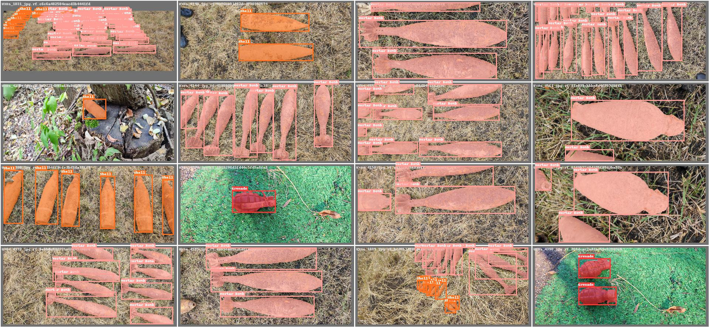

# CTX-UXO: A Comprehensive Dataset for Detection and Identification of UneXploded Ordnances


Dataset can be found [here](https://ieee-dataport.org/documents/ctx-uxo-comprehensive-dataset-detection-and-identification-unexploded-ordnances)

[First article](https://www.grigorestamatescu.com/files/med24.pdf)

If you use our work, don't forget to cite us:
```BibTeX
@data{cwnm-de53-24,
doi = {10.21227/cwnm-de53},
url = {https://dx.doi.org/10.21227/cwnm-de53},
author = {Craioveanu, Gheorghe Marian and Stamatescu, Grigore},
publisher = {IEEE Dataport},
title = {CTX-UXO: A Comprehensive Dataset for Detection and Identification of UneXploded Ordnances},
year = {2024} }

@inproceedings{craioveanu2024detection,
  title={Detection and Identification of Unexploded Ordnance Using a Two-Step Deep Learning Methodology},
  author={Craioveanu, Marian G and Stamatescu, Grigore},
  booktitle={2024 32nd Mediterranean Conference on Control and Automation (MED)},
  pages={257--262},
  year={2024},
  organization={IEEE}
}
```
